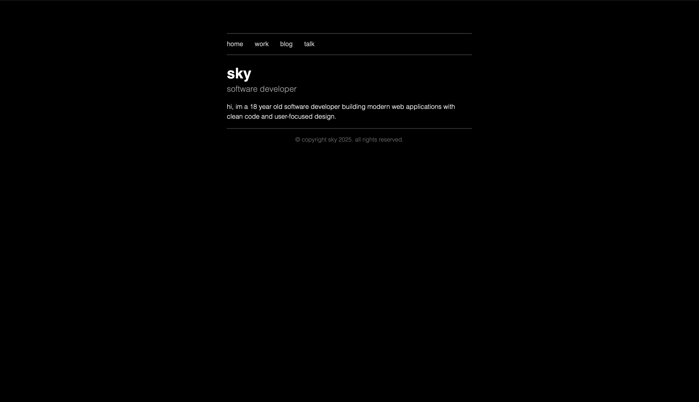
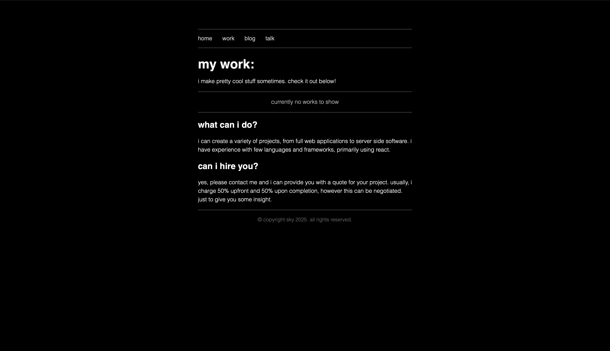
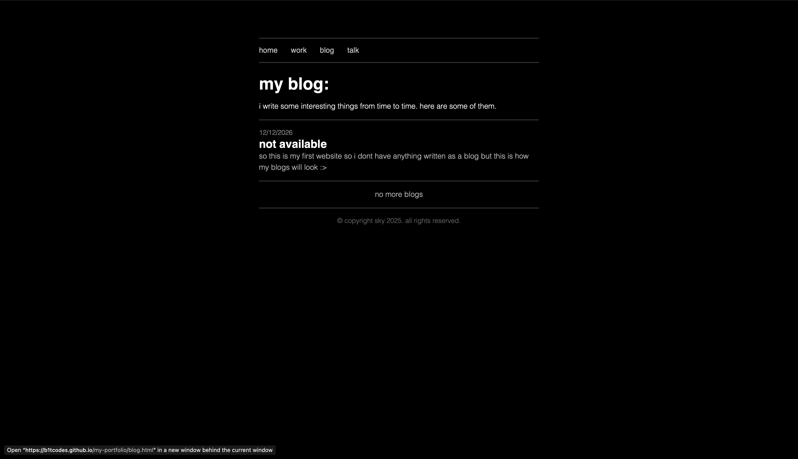
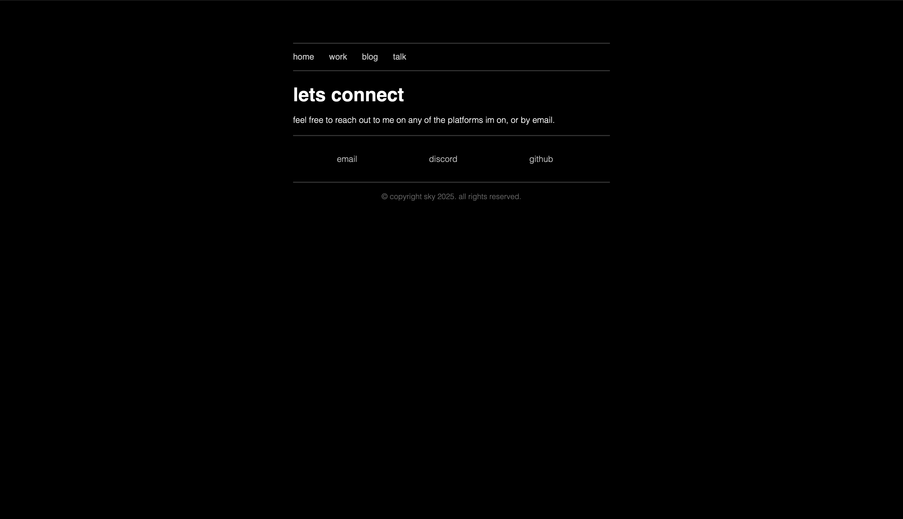

# [skytheme](https://b1tcodes.github.io/my-portfolio/)

Hey! Welcome to a little corner of the internet, made for Hack Club's [personal site YSWS](https://page.hackclub.com) program.

This website is a personal website inspired by dark theme minimal design that serves as a good portfolio to showcase your project and personality to recuriters.

<table width="100%">
  <tr>
    <td width="50%">
      
    </td>
    <td width="50%">
      
    </td>
  </tr>
</table>

<table width="100%">
  <tr>
    <td width="50%">
      
    </td>
    <td width="50%">
      
    </td>
  </tr>
</table>

## Features
- looks cool ;)
- Minimal design
- learned some js to add the message at end page when you click dc
- 100% mobile compatible

